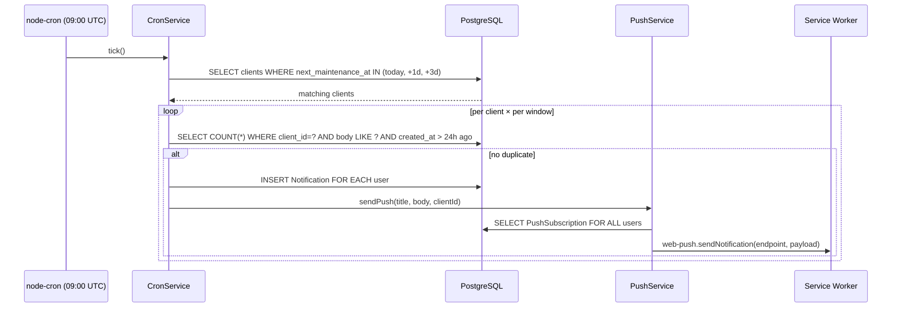
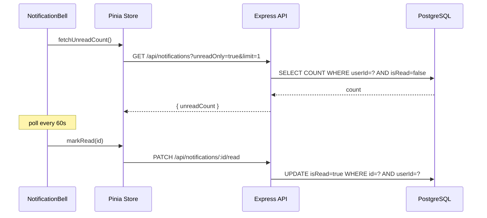
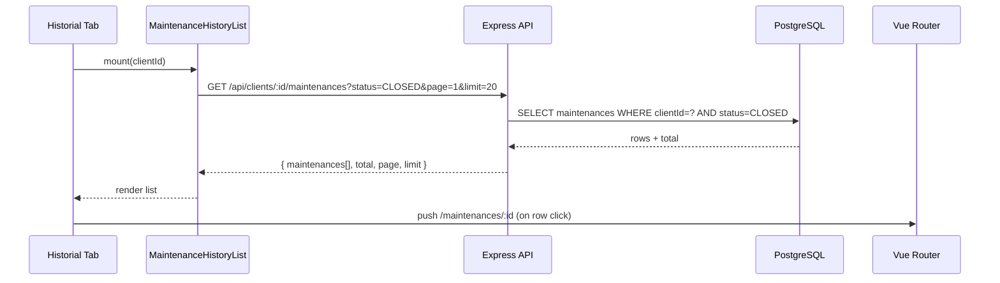

# Design: Client History + Notifications (Slice 6)

## Technical Approach

Enable the disabled Historial tab with CLOSED-only filtering and navigate-to-detail, and implement the full notifications backend (list/read/read-all/push-subscribe endpoints, daily cron reminders, web-push delivery) plus frontend bell + service worker. Leverages existing Prisma models (`Notification`, `PushSubscription`), shared types, and VAPID env config — zero schema changes required.

## Architecture Decisions

| # | Decision | Alternatives | Rationale |
|---|----------|-------------|-----------|
| 1 | In-process `node-cron` (09:00 UTC) | BullMQ/Redis, external cron service | Zero-infra MVP. Parent design #3 already chose this. Dedup via DB query prevents double-fire on restart. |
| 2 | Reuse `GET /api/clients/:id/maintenances` with added `status` query param | New `/api/clients/:id/history` endpoint | Endpoint already exists with pagination + technician include. `maintenanceQuerySchema` already validates `status` enum — just needs wiring to service. |
| 3 | Push subscribe/unsubscribe under `/api/push/*` prefix | Nest under `/api/notifications/*` | Separation of concerns: push is a delivery channel, notifications are the domain entity. Matches parent design API contract. |
| 4 | Polling (60s interval) for bell unread count | WebSocket, SSE | No WS infra in project. 60s polling is lightweight (single COUNT query) and matches MVP complexity. |
| 5 | Service worker at `public/sw.js` (static file) | Workbox, vite-plugin-pwa | Minimal footprint. Only handles `push` event + `notificationclick`. No build-step dependency. |
| 6 | Cron creates one `Notification` per user per client per window | Single global notification | Per-user allows individual mark-read. Per-client+window dedup key prevents duplicates. |

## Data Flow

### Reminder Cron Flow



### Bell Refresh Flow



### History Fetch Flow



## File Changes

| File | Action | Description |
|------|--------|-------------|
| `apps/api/src/modules/notifications/notifications.controller.ts` | Create | Router: GET `/api/notifications`, PATCH `/:id/read`, POST `/read-all` |
| `apps/api/src/modules/notifications/notifications.service.ts` | Create | listForUser, markRead, markAllRead, countUnread |
| `apps/api/src/modules/notifications/notifications.schema.ts` | Create | Zod schemas: listQuery, pushSubscribe, pushUnsubscribe |
| `apps/api/src/services/notifications/cron.service.ts` | Create | `startCron()` — node-cron 09:00 UTC, query due clients, dedup, insert notifications, trigger push |
| `apps/api/src/services/notifications/push.service.ts` | Create | VAPID init, `sendToUser(userId, payload)`, `sendAll(payload)` via web-push |
| `apps/web/src/components/history/MaintenanceHistoryList.vue` | Create | Paginated CLOSED list, `router.push` on click, empty state |
| `apps/web/src/components/layout/NotificationBell.vue` | Create | Bell icon + badge + slide-in drawer, 60s poll |
| `apps/web/src/views/NotificationsPage.vue` | Create | Full notification list with mark-read actions |
| `apps/web/src/stores/notifications.ts` | Create | Pinia store: list, unreadCount, markRead, markAllRead, fetch |
| `apps/web/src/composables/usePushSubscription.ts` | Create | SW register, permission request, POST subscription to backend |
| `apps/web/public/sw.js` | Create | `push` event → `showNotification()`, `notificationclick` → `clients.openWindow` |
| `apps/api/src/index.ts` | Modify | Import + mount `notificationsRouter`, import `pushRouter`, call `startCron()` after DB connect |
| `apps/api/src/config/env.ts` | Modify | No change needed — VAPID keys already defined as optional |
| `apps/api/package.json` | Modify | Add `node-cron`, `web-push`, `@types/node-cron`, `@types/web-push` |
| `apps/api/src/modules/maintenances/maintenances.service.ts` | Modify | `listClientMaintenances` — add optional `status` param to Prisma where clause |
| `apps/api/src/modules/clients/clients.controller.ts` | Modify | Pass `req.query.status` to `listClientMaintenances` |
| `apps/web/src/views/ClientDetailPage.vue` | Modify | Remove `disabled: true` from Historial tab, replace placeholder with `MaintenanceHistoryList` |
| `apps/web/src/components/layout/AppHeader.vue` | Modify | Add `<NotificationBell />` between spacer and user info |
| `apps/web/src/main.ts` | Modify | Register service worker (`usePushSubscription` init after auth check) |
| `apps/web/src/router/index.ts` | Modify | Add `/notifications` route → `NotificationsPage.vue` |

## Interfaces / Contracts

### New API Endpoints

| Method | Path | Auth | Request | Response | Errors |
|--------|------|------|---------|----------|--------|
| GET | `/api/notifications` | Yes (cookie) | `?unreadOnly=true&page=1&limit=20` | `200 { notifications: Notification[], unreadCount: number, page, limit }` | 401 |
| PATCH | `/api/notifications/:id/read` | Yes (cookie) | — | `200 { notification }` | 401, 404 |
| POST | `/api/notifications/read-all` | Yes (cookie) | — | `200 { count: number }` | 401 |
| POST | `/api/push/subscribe` | Yes (cookie) | `{ endpoint, keys: { p256dh, auth } }` | `201` | 401, 409 (dup endpoint) |
| POST | `/api/push/unsubscribe` | Yes (cookie) | `{ endpoint }` | `204` | 401, 404 |

### Modified Endpoint

`GET /api/clients/:id/maintenances` — now passes `status` query param (already validated by `maintenanceQuerySchema`) through to `listClientMaintenances`. When `status=CLOSED`, Prisma where clause adds `status: "CLOSED"`.

### Cron Dedup Logic

```
dedup_key = notification.body contains client.name + window label ("in 3 days" / "tomorrow" / "today")
query: SELECT 1 FROM notifications WHERE user_id = ? AND client_id = ? AND body LIKE ? AND created_at > NOW() - INTERVAL '24 hours'
```

## Testing Strategy

| Layer | What | Approach |
|-------|------|----------|
| Build | TypeScript compilation | `pnpm --filter api build` + `pnpm --filter web build` (vue-tsc) |
| Manual | History tab | Open client → click Historial → verify CLOSED list → click row → navigates to detail |
| Manual | Bell | Login → see bell with count → open drawer → mark read → badge decrements |
| Manual | Cron | Trigger cron manually (expose temp endpoint or call directly) → verify notifications created |
| Manual | Push | Grant permission → trigger notification → verify browser shows push |
| Smoke | SW cache-bust | Deploy → verify new SW activates (version query param) |

## Migration / Rollout

No schema migration required — `Notification` and `PushSubscription` tables already exist. Deployment steps:
1. Add `VAPID_PUBLIC_KEY`, `VAPID_PRIVATE_KEY`, `VAPID_SUBJECT` to `.env` (one-time `npx web-push generate-vapid-keys`)
2. Add `node-cron` + `web-push` deps → `pnpm install`
3. Deploy API (cron starts automatically on boot)
4. Deploy web (SW registers on first authenticated page load)

## Open Questions

- [ ] Should the cron service expose a manual trigger endpoint (`POST /api/admin/trigger-reminders`) for testing, or rely on log inspection? (Leaning: yes, behind admin auth — simplifies smoke testing.)
