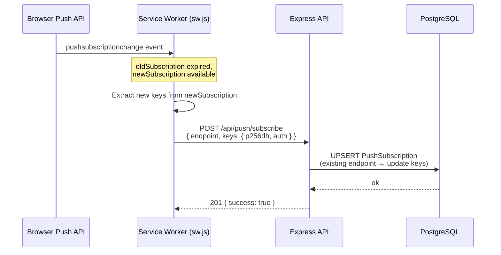
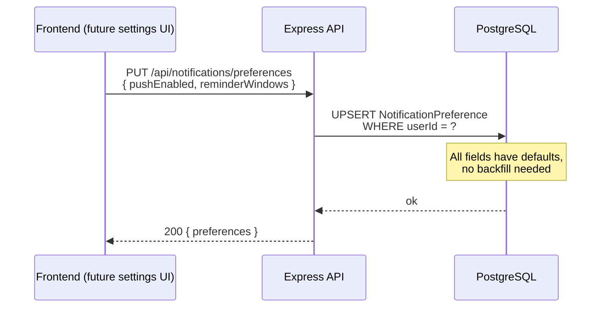
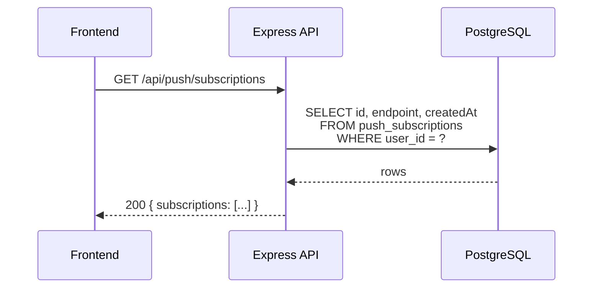

# Design: Notifications Hardening (Slice 6-1)

## Technical Approach

This change hardens the push notification system delivered in slice 6 across three chained PRs. PR-A fixes three critical reliability bugs: service worker lifecycle (immediate activation via `skipWaiting`/`clients.claim`, subscription rotation via `pushsubscriptionchange`), and a cron race condition that can double-fire reminders when multiple API instances are running. PR-B adds schema evolution (`NotificationPreference` model), input validation (Zod body length check), batch `markAllRead`, ARIA list semantics, and VAPID documentation. PR-C introduces structured logging (pino), query optimization (single-query count dedup), new push subscription management endpoints, and frontend UX polish (`isLoading` state, URL match tightening).

The key architectural choice is **Postgres-native advisory locking** for cron dedup instead of introducing Redis or an external job queue. This matches the project's zero-infra philosophy — Prisma already manages the Postgres connection, and `pg_advisory_xact_lock` auto-releases on transaction end with no cleanup surface. For structured logging, **pino** was chosen over Winston/Bunyan for its speed, small footprint, and JSON-first output that pairs well with log aggregators.

Schema migration for `NotificationPreference` is non-destructive (all fields have defaults), so existing data requires no backfill. The composite index on `Notification(userId, isRead, createdAt)` already exists from slice 6 — M3 is a verification item, not a code change.

## Architecture Decisions

| # | Decision | Alternatives | Rationale |
|---|----------|-------------|-----------|
| 1 | `pg_advisory_xact_lock` for cron dedup | Redis SETNX, BullMQ, external cron (Heroku scheduler) | Postgres-native, no new infra, auto-released on transaction end. Matches project stack (Prisma + Postgres). Lock key is a stable ASCII constant. |
| 2 | `skipWaiting()` + `clients.claim()` in SW install/activate | Version query param cache-bust, `postMessage` reload | Standard SW lifecycle pattern. Ensures new SW activates immediately after deploy without requiring user to close all tabs. |
| 3 | `pushsubscriptionchange` handler with backend re-subscribe | Ignore rotation (break push after ~2yr), polling endpoint validity | Chrome rotates push subscriptions periodically. The handler captures the new subscription and POSTs it to the existing `/api/push/subscribe` endpoint. |
| 4 | pino for structured logging | Winston, Bunyan, console.log wrapper | Fastest Node.js logger, JSON output by default, `pino-pretty` for dev readability. ~2MB installed, server-side only (no web bundle impact). |
| 5 | Zod `body` length validation in service layer | Express middleware, DB column constraint, frontend-only | Service layer is the trust boundary. Zod is already used for request validation in the project. DB constraint would give unhelpful error messages. |
| 6 | `prisma.$transaction` with chunks of 1000 for `markAllRead` | Single unbounded `UPDATE`, raw SQL `UPDATE ... WHERE id IN (...)` | Prisma's `updateMany` is already a single SQL UPDATE but can hold row locks for large datasets. Chunking via `$transaction` with `LIMIT`-equivalent batches reduces lock duration. |
| 7 | `role="list"` + `role="listitem"` on Bell drawer items | `<ul>`/`<li>` semantic HTML, ARIA only | The drawer uses `<button>` elements inside a `<div>` (not `<ul>`). Adding explicit ARIA roles matches the MaintenanceHistoryList pattern from slice 6 without restructuring the template. |
| 8 | `isLoading` ref in `usePushSubscription` composable | Promise-only (caller tracks state), Pinia store | Composable-level ref keeps state co-located with the async operations. Multiple components can share the same loading state via the composable's returned ref. |
| 9 | New endpoints under existing `/api/push/*` prefix | New `/api/devices/*` prefix, nest under `/api/notifications/*` | Consistency with existing `POST /api/push/subscribe` and `POST /api/push/unsubscribe`. Push subscriptions are a delivery channel, not a separate domain. |
| 10 | Tighten URL match to `pathname.startsWith("/clients/")` | Regex, `url.includes("/clients/")` (current) | Current `includes("/clients")` matches `/clients`, `/clients/123`, but also `/some/path?redirect=/clients`. Using `pathname` + `startsWith` is exact and avoids false positives. |

## Data Flow

### PR-A1: pushsubscriptionchange Handling



### PR-A2: Cron with Advisory Lock

```mermaid
sequenceDiagram
    participant Cron as node-cron (09:00 UTC)
    participant CS as CronService
    participant Lock as withAdvisoryLock
    participant DB as PostgreSQL
    participant PS as PushService

    Cron->>CS: tick()
    CS->>Lock: withAdvisoryLock(0x6E4E5446494E475249, runReminders)
    Lock->>DB: BEGIN; SELECT pg_advisory_xact_lock(key)
    alt Lock acquired
        DB-->>Lock: ok
        Lock->>DB: runReminders() — query clients, dedup, insert, push
        DB-->>Lock: results
        Lock->>DB: COMMIT (auto-releases lock)
        Lock-->>CS: T | null (result)
    else Lock NOT acquired (another worker running)
        DB-->>Lock: would-block or error
        Lock-->>CS: null (skip this run)
        Note over CS: Idempotent — next day's cron retries
    end
```

### PR-B: NotificationPreference Model



### PR-C: GET /api/push/subscriptions



## PR-by-PR Work Units

| PR | Commit | Files | Goal | Work Unit |
|----|--------|-------|------|-----------|
| PR-A | 1 | `apps/web/public/sw.js` | C1+C2 SW lifecycle | "Add pushsubscriptionchange handler + skipWaiting/clients.claim for immediate SW activation" |
| PR-A | 2 | `apps/api/src/lib/lock.ts`, `apps/api/src/services/notifications/cron.service.ts` | C3 cron dedup | "Wrap cron runReminders in pg_advisory_xact_lock to prevent multi-instance double-fire" |
| PR-B | 3 | `apps/api/prisma/schema.prisma`, `apps/api/prisma/migrations/*` | H3 schema | "Add NotificationPreference model with pushEnabled + reminderWindows defaults" |
| PR-B | 4 | `apps/api/src/modules/notifications/notifications.service.ts`, `apps/api/src/modules/notifications/notifications.schema.ts` | H4+H5 validation+batching | "Add Zod body length validation (max 500) and chunked markAllRead (batches of 1000)" |
| PR-B | 5 | `apps/web/src/components/layout/NotificationBell.vue` | H2 list semantics | "Add role=list + role=listitem to Bell drawer notification items" |
| PR-B | 6 | `README.md`, `apps/api/.env.example` | H1 VAPID docs | "Document VAPID key generation setup in README and .env.example" |
| PR-C | 7 | `apps/api/src/lib/logger.ts`, `apps/api/package.json` | M1 pino setup | "Add pino logger with dev/prod modes (pino-pretty in development)" |
| PR-C | 8 | `apps/api/src/services/notifications/cron.service.ts`, `apps/api/src/services/notifications/push.service.ts`, `apps/api/src/modules/notifications/notifications.service.ts` | M1 logger wiring | "Replace console.log/error with structured logger across notification modules" |
| PR-C | 9 | `apps/api/src/modules/notifications/notifications.service.ts` | M2 count dedup | "Merge total + unreadCount into single conditional aggregation query" |
| PR-C | 10 | `apps/api/src/services/notifications/push.controller.ts` | M4 new endpoints | "Add GET /api/push/subscriptions + DELETE /api/push/subscriptions/:id" |
| PR-C | 11 | `apps/web/public/sw.js` | M5+M8 URL match + tag verify | "Tighten notificationclick URL match to pathname.startsWith; verify tag dedup" |
| PR-C | 12 | `apps/web/src/composables/usePushSubscription.ts`, `apps/web/src/components/layout/NotificationBell.vue` | M6 isLoading UX | "Add isLoading ref to usePushSubscription + spinner in NotificationBell" |
| PR-C | 13 | `openspec/changes/archive/2026-06-24-mantenti-mvp-slice-6/design.md` | M7 drift fix | "Update archived slice 6 design.md to mention NotificationsPage.vue + usePushSubscription.ts" |

## File Changes

| File | Action | PR | Description |
|------|--------|----|-----------|
| `apps/web/public/sw.js` | Modify | PR-A, PR-C | Add `pushsubscriptionchange` handler, `skipWaiting`/`clients.claim`, tighten URL match to `pathname.startsWith("/clients/")` |
| `apps/api/src/lib/lock.ts` | Create | PR-A | `withAdvisoryLock(key, fn)` helper using `pg_advisory_xact_lock` inside a Prisma `$transaction` |
| `apps/api/src/services/notifications/cron.service.ts` | Modify | PR-A, PR-C | Wrap `runReminders()` in `withAdvisoryLock`; replace `console.log` with `logger` |
| `apps/api/prisma/schema.prisma` | Modify | PR-B, PR-C | Add `NotificationPreference` model; verify composite index on `Notification` (already exists) |
| `apps/api/prisma/migrations/*` | Create | PR-B | Prisma migration for `notification_preferences` table |
| `apps/api/src/modules/notifications/notifications.service.ts` | Modify | PR-B, PR-C | Add Zod body length validation, chunked `markAllRead`, single-query count dedup, replace `console.log` |
| `apps/api/src/modules/notifications/notifications.schema.ts` | Modify | PR-B | Add `createNotificationSchema` with `body` max 500 chars |
| `apps/web/src/components/layout/NotificationBell.vue` | Modify | PR-B, PR-C | Add `role="list"`/`role="listitem"` ARIA semantics; add `isLoading` spinner |
| `README.md` | Modify | PR-B | Add "Setup VAPID" section with `npx web-push generate-vapid-keys` command |
| `apps/api/.env.example` | Modify | PR-B | Add VAPID key comments and setup instructions |
| `apps/api/src/lib/logger.ts` | Create | PR-C | pino-based logger with `pino-pretty` transport in dev, JSON in prod |
| `apps/api/package.json` | Modify | PR-C | Add `pino` + `pino-pretty` dependencies |
| `apps/api/src/services/notifications/push.service.ts` | Modify | PR-C | Replace `console.log`/`console.error`/`console.warn` with `logger` |
| `apps/api/src/services/notifications/push.controller.ts` | Modify | PR-C | Add `GET /subscriptions` and `DELETE /subscriptions/:id` endpoints |
| `apps/web/src/composables/usePushSubscription.ts` | Modify | PR-C | Add `isLoading` reactive ref exposed from composable |
| `openspec/changes/archive/2026-06-24-mantenti-mvp-slice-6/design.md` | Modify | PR-C | Add mention of `NotificationsPage.vue` + `usePushSubscription.ts` in File Changes table |
| `openspec/specs/notifications/spec.md` | Modify | PR-C | Add requirements for pushsubscriptionchange, advisory lock, structured logging, preferences, subscription list endpoints |

## Interfaces / Contracts

### New API Endpoints (PR-C)

| Method | Path | Auth | Request | Response | Errors |
|--------|------|------|---------|----------|--------|
| GET | `/api/push/subscriptions` | Yes (cookie) | — | `200 { subscriptions: PushSubscription[] }` where each item is `{ id, endpoint, createdAt }` | 401 |
| DELETE | `/api/push/subscriptions/:id` | Yes (cookie) | — | `204` | 401, 404 |

### Modified Schema (PR-B)

Add `NotificationPreference` model:

```prisma
model NotificationPreference {
  id              String   @id @default(cuid())
  userId          String   @unique
  pushEnabled     Boolean  @default(true)
  reminderWindows String[] @default(["3d", "1d", "0d"])
  user            User     @relation(fields: [userId], references: [id], onDelete: Cascade)
  createdAt       DateTime @default(now()) @map("created_at")
  updatedAt       DateTime @updatedAt @map("updated_at")

  @@map("notification_preferences")
}
```

Add relation to `User` model:

```prisma
model User {
  // ... existing fields
  notificationPreference NotificationPreference?
}
```

**Note on composite index (M3):** The `Notification` model already has `@@index([userId, isRead, createdAt(sort: Desc)])` from slice 6. No schema change needed — M3 is a verification item.

### Cron Lock Contract (PR-A)

```ts
// apps/api/src/lib/lock.ts
import prisma from "./prisma";

const ADVISORY_LOCK_KEY = BigInt("0x6E4E5446494E475249"); // "NOTIFYING" in ASCII hex

export async function withAdvisoryLock<T>(
  key: bigint,
  fn: () => Promise<T>
): Promise<T | null> {
  return prisma.$transaction(async (tx) => {
    const [result] = await tx.$queryRaw<[{ acquired: boolean }]>`
      SELECT pg_try_advisory_xact_lock(${key}) AS acquired
    `;
    if (!result.acquired) return null;
    return fn();
  });
}
```

- Uses `pg_try_advisory_xact_lock(key)` — non-blocking, returns false immediately if another worker holds the lock.
- Auto-releases on transaction commit/rollback (xact variant).
- Caller checks for `null` return to skip the run (idempotent — next cron tick retries).
- Lock key `0x6E4E5446494E475249` is a stable 64-bit constant ("NOTIFYING" in ASCII hex).

### Logger Contract (PR-C)

```ts
// apps/api/src/lib/logger.ts
import pino from "pino";

export const logger = pino(
  process.env.NODE_ENV === "production"
    ? {} // JSON output
    : { transport: { target: "pino-pretty" } } // human-readable
);
```

### Body Length Validation (PR-B)

```ts
// notifications.schema.ts addition
export const createNotificationSchema = z.object({
  title: z.string().min(1).max(200),
  body: z.string().min(1).max(500, "Notification body must be 500 characters or less"),
});
```

Applied in `createNotification` service function — throws `ZodError` if body exceeds 500 chars.

### Batched markAllRead Contract (PR-B)

```ts
// notifications.service.ts
export async function markAllRead(userId: string): Promise<number> {
  const BATCH_SIZE = 1000;
  let totalUpdated = 0;

  while (true) {
    const result = await prisma.$transaction(async (tx) => {
      // Get a batch of unread IDs
      const batch = await tx.notification.findMany({
        where: { userId, isRead: false },
        select: { id: true },
        take: BATCH_SIZE,
      });

      if (batch.length === 0) return 0;

      const ids = batch.map((n) => n.id);
      const updated = await tx.notification.updateMany({
        where: { id: { in: ids } },
        data: { isRead: true },
      });

      return updated.count;
    });

    totalUpdated += result;
    if (result < BATCH_SIZE) break;
  }

  return totalUpdated;
}
```

## Testing Strategy

| PR | Layer | What | Approach |
|----|-------|------|----------|
| PR-A | Smoke | SW activation | Deploy → open DevTools → Application → Service Workers → verify "activated and is activating" immediately (no waiting for tab close) |
| PR-A | Smoke | Cron dedup | Run 2 API instances (docker-compose scale api=2) → trigger cron → verify only 1 set of notifications created (check DB count) |
| PR-A | Build | TypeScript | `pnpm --filter api build` + `pnpm --filter web build` — no new tsc errors |
| PR-B | Dry-run | Migration | `npx prisma migrate diff --from-schema-datamodel --to-schema-datamodel` — verify additive-only (no drops) |
| PR-B | Unit | Body validation | Call `createNotification` with body > 500 chars → expect ZodError |
| PR-B | Unit | Batch markAllRead | Seed 2500 unread notifications → call `markAllRead` → verify all 2500 marked read, no timeout |
| PR-B | Manual | ARIA semantics | Open Bell drawer → inspect DOM → verify `role="list"` on container, `role="listitem"` on each button |
| PR-B | Build | TypeScript | `pnpm --filter api build` + `pnpm --filter web build` |
| PR-C | Smoke | GET endpoint | `curl -b cookie http://localhost:3000/api/push/subscriptions` → verify JSON array |
| PR-C | Smoke | DELETE endpoint | `curl -X DELETE -b cookie http://localhost:3000/api/push/subscriptions/:id` → verify 204 |
| PR-C | Unit | Pino log structure | Call any notification function → verify JSON output has `level`, `time`, `msg` fields |
| PR-C | Perf | Composite index | `EXPLAIN ANALYZE SELECT ... WHERE user_id = ? AND is_read = false ORDER BY created_at DESC` → verify index scan (not seq scan) |
| PR-C | Build | TypeScript | `pnpm --filter api build` + `pnpm --filter web build` |

## Migration / Rollout

### PR-A
- **No schema change.** Deploy API (new `lock.ts` + modified `cron.service.ts`) + redeploy web (new `sw.js`).
- SW will update on next page reload (now immediate thanks to `skipWaiting`).
- If advisory lock fails to acquire (e.g., Postgres permission issue), cron run is skipped — logged as warning, next day retries.
- **Rollback**: revert commits. SW and cron revert to old behavior. Existing push still works.

### PR-B
- **Schema migration**: `npx prisma migrate deploy` creates `notification_preferences` table. Non-destructive (all defaults, no backfill).
- Deploy API + redeploy web.
- **Rollback**: `npx prisma migrate reset` drops table. Service validation reverts (no length check). `markAllRead` reverts to unbounded UPDATE.

### PR-C
- **New deps**: `pnpm install` (adds `pino` + `pino-pretty`, ~2MB server-side).
- Deploy API + redeploy web.
- **Rollback**: remove pino import, revert to `console.log`. New endpoints become 404. Composite index already existed — no index to drop.

See proposal.md risks table for detailed risk/mitigation per PR.

## Open Questions

- [ ] Should `NotificationPreference.reminderWindows` be exposed via a settings UI in this slice, or just create the model + API for future use? (Leaning: model + API only — no UI in this slice to keep scope tight.)
- [ ] Should `GET /api/push/subscriptions` include a `lastSeenAt` field (requires tracking when each subscription was last used for push delivery)? (Leaning: no — adds write overhead on every push send. Can add later if needed.)
- [ ] M3 (composite index) already exists in the schema from slice 6 (`@@index([userId, isRead, createdAt(sort: Desc)])`). Should we remove M3 from the task list and convert it to a verification checkbox, or keep it as a "confirm and document" item? (Leaning: verification only — no code change needed.)
